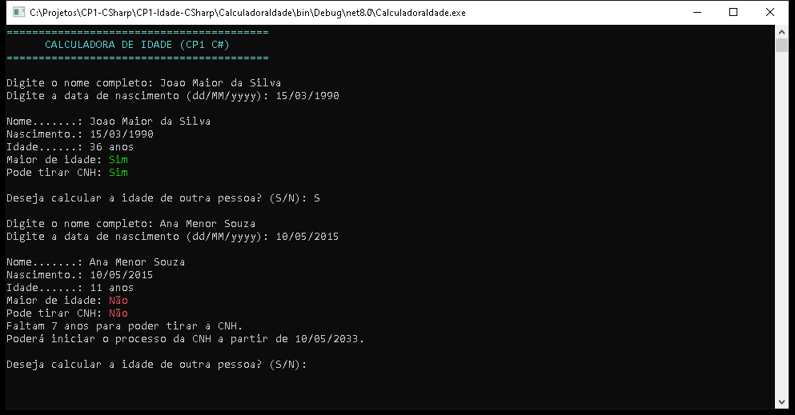

# Calculadora de Idade

**Raphael Oliveira Sinelli Mendonça, RM568346**
**Henrique Spoltore Moreno Pavão dos Santos, RM568130**

Turma 2TDSPS, curso de Tecnologia em Análise e Desenvolvimento de Sistemas (TDS).
Disciplina de Programação em C# e .NET, Checkpoint 1.
Professor Dr. Marcel Stefan Wagner.

## Descrição do projeto

Aplicação de console que lê o nome completo e a data de nascimento de uma pessoa,
calcula a idade com base na data atual do sistema operacional e informa se a pessoa é
maior de idade e se já pode iniciar o processo da CNH. Toda a lógica de cálculo fica em
uma struct própria, obrigatória pelo enunciado do checkpoint.

## Funcionalidades

- Leitura do nome completo, com nova tentativa caso o valor fique em branco.
- Leitura da data de nascimento no formato `dd/MM/yyyy`, usando
  `DateTime.TryParseExact`, repetindo a pergunta até receber uma data válida.
- Rejeita datas no futuro e idades acima de 130 anos, com mensagem clara.
- Cálculo da idade em anos completos, descontando um ano quando o aniversário ainda não
  ocorreu no ano atual. Nascidos em 29 de fevereiro são tratados corretamente: em anos
  não bissextos, o aniversário é considerado como tendo ocorrido em 1º de março.
- Informa se a pessoa é maior de idade (18 anos ou mais).
- Informa, em mensagem separada, se a pessoa já pode iniciar o processo da CNH. Caso não
  possa, informa quantos anos faltam.
- Saída organizada, com título, cores (verde para sim, vermelho para não) e acentuação
  correta (`Console.OutputEncoding = UTF8`).
- Ao final de cada cálculo, pergunta se o usuário deseja calcular a idade de outra
  pessoa (S/N), repetindo enquanto for necessário.

## Tecnologias

- C# 12 / .NET 8 (net8.0)
- Aplicação de Console
- Visual Studio 2022

## Estrutura de pastas e classes

```
CalculadoraIdade.sln
CalculadoraIdade/
  CalculadoraIdade.csproj
  Pessoa.cs      Struct com Nome, DataNascimento e toda a lógica de idade
  Program.cs     Entrada e saída de dados pelo console
```

A separação segue o seguinte princípio: toda a lógica de cálculo de idade, maioridade e
elegibilidade para CNH fica dentro da struct `Pessoa`. A classe `Program` cuida apenas de
ler os dados do usuário, validar o formato de entrada e exibir os resultados.

## Como executar

### Visual Studio 2022

1. Abra o arquivo `CalculadoraIdade.sln`.
2. Defina o projeto `CalculadoraIdade` como projeto de inicialização (já vem configurado).
3. Pressione F5 para compilar e executar (ou Ctrl+F5 para executar sem depurar).

### dotnet CLI

```
dotnet build CalculadoraIdade.sln
dotnet run --project CalculadoraIdade/CalculadoraIdade.csproj
```

## Prints

A imagem abaixo fica na pasta `docs/prints`:


